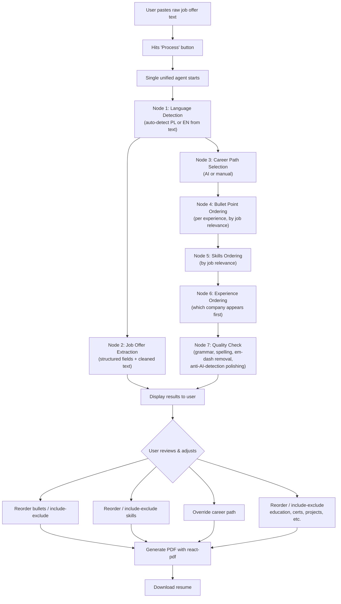
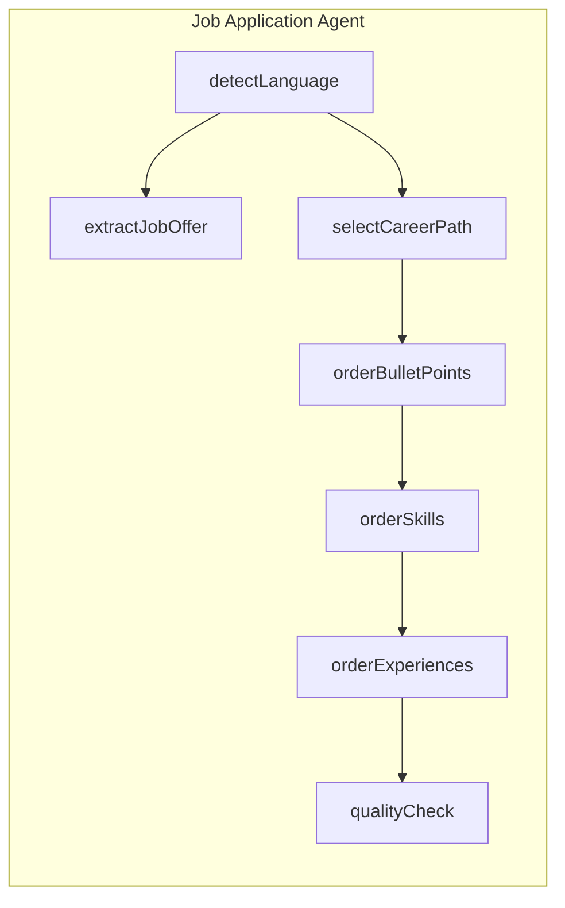
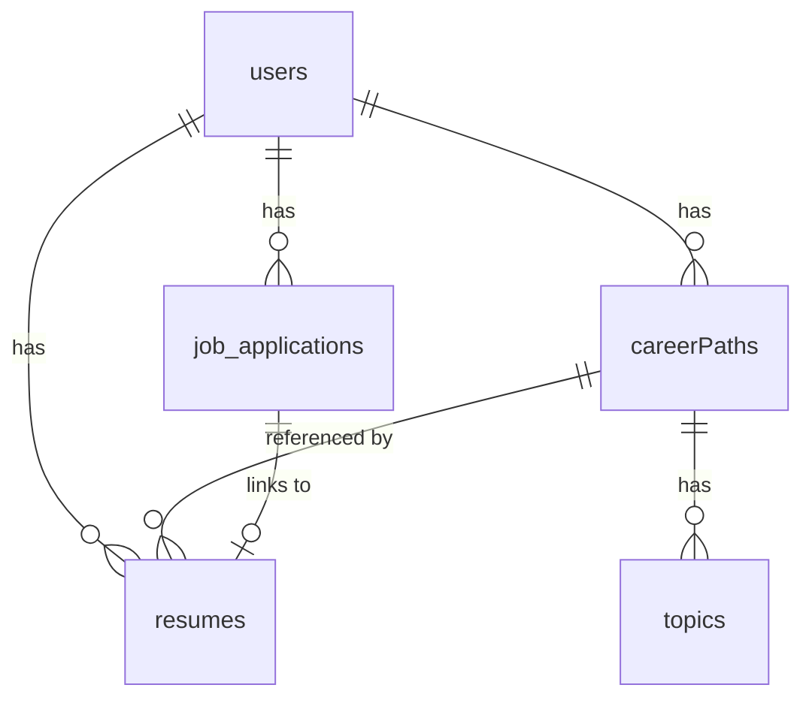
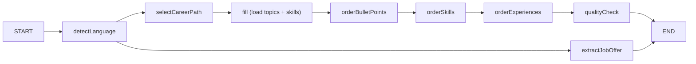

# Job Applications Feature — Business Requirements (v2)

> **Status:** REVISED — incorporates all user feedback from v1 review  
> **Date:** 2026-07-27  
> **Based on:** Codebase analysis + user briefing + user review comments  
> **Supersedes:** [earlier resume-creation.md](file:///Users/qemc/Documents/Code/resume_agent-1/requ/resume-creation.md)

---

## 1. Context & Current State

### 1.1 What Exists Today

The application has **three layers** already implemented:

| Layer | Page | Data Managed | Key Tables |
|-------|------|-------------|------------|
| **Master Data** | My Resume Data (`/my-resume`) | Contact info, experiences, education, certificates, projects, skills, languages, interests | `contact_data`, `experiences`, `skills`, `education`, `certificates`, `projects`, `languages`, `interests` |
| **AI Enhancement** | *(background)* | Raw experience → structured bullet points | `ai_enhanced_experience` |
| **Narrative** | Career Paths (`/career-paths`, `/career-paths/:id`) | Career path name & description, AI-generated bullet points (topics) per experience | `careerPaths`, `topics` |

### 1.2 Existing AI Agents

| Agent | Location | Purpose | Flow |
|-------|----------|---------|------|
| **Enhance Agent** | [enhance/](file:///Users/qemc/Documents/Code/resume_agent-1/apps/backend/src/agentic/enhance/enhance.ts) | Takes raw experience description → extracts workstreams → produces structured bullet points | `fill → architect → writer → saver` |
| **Topics Agent** | [topics/](file:///Users/qemc/Documents/Code/resume_agent-1/apps/backend/src/agentic/topics/topics.ts) | Takes enhanced bullet points + career path context → generates final bullet point text per experience | `check → topics → unify` |
| **Resume Agent** | [resume/](file:///Users/qemc/Documents/Code/resume_agent-1/apps/backend/src/agentic/resume/resume.ts) | Loads career path topics + experiences + skills; intended to rank them by job relevance | Currently only `fill` node (data loading); `selectExp` and `selectSkills` nodes exist as stubs |

### 1.3 Bilingual Architecture (Critical)

The application supports **PL (Polish)** and **EN (English)** as resume languages. This is a **data-level separation**, not a UI toggle:

- Every data entity (experiences, skills, contact data, career paths, topics) has a `resume_lang` column
- A user can have **completely different sets** of data per language
- Career paths are language-scoped — a PL career path has PL topics
- AI prompts are **duplicated per language**: every prompt exists in EN and PL variants
- Zod structured output schemas also have PL/EN variants with Polish/English field descriptions
- Frontend translations use `pickLang()` with per-component dictionaries in [translations.ts](file:///Users/qemc/Documents/Code/resume_agent-1/apps/frontend/src/lib/translations.ts)

> [!IMPORTANT]
> **Language is auto-detected by the agent from the job offer text.** The agent's first common node analyzes the pasted job text and determines whether it's PL or EN. This detected language then drives which data set (career paths, topics, skills, etc.) the entire pipeline operates on. The user does NOT manually select a language for job applications.

### 1.4 Existing Resume Table

The [resumes table](file:///Users/qemc/Documents/Code/resume_agent-1/apps/backend/src/db/schema.ts#L185-L200) already exists in the schema:

```typescript
resumes = pgTable('resumes', {
    id: serial('id').primaryKey(),
    career_path_id: integer → careerPaths.id,
    user_id: integer → users.id,
    experiences: jsonb<ResumeExp[]>(),  // snapshot of experience + topics
    skills: jsonb<string[]>(),          // snapshot of skills
    resume_summary: text(),             // AI-generated summary
})
```

The `ResumeExp` type contains: `exp_id`, `company_name`, `start_date`, `end_date`, `current`, `topics: string[]`.

### 1.5 Existing Resume Agent State

The [resume agent state](file:///Users/qemc/Documents/Code/resume_agent-1/apps/backend/src/agentic/resume/state.ts) already defines:
- `carrerPathId`, `userId`, `language`
- `skills: SkillsDb[]`
- `experiences: ResumeExp[]`
- `jobOfferText: string`
- Zod schemas for `selectExpPromptOutput` and `selectSkillsPromptOutput` (EN + PL)

---

## 2. Feature: Job Applications

### 2.1 High-Level Flow



### 2.2 Input: Raw Job Offer Text

- **Input method:** User **pastes the full text** of a job posting into a textarea
- **No URL scraping** — the user copies the text from the job board manually
- The job offer text can be in **Polish or English** (the agent auto-detects)
- The raw text is preserved in the database alongside the extracted/cleaned version

### 2.3 Unified Agent Architecture

> [!IMPORTANT]
> **There is ONE single agent**, not two separate ones. The agent has a common language-detection node at the start, then proceeds through extraction and content selection sequentially.

The unified agent has the following nodes:



---

### 2.4 Node 1: Language Detection (Common Node)

**Purpose:** Auto-detect whether the job offer text is in Polish or English.

**Input:** Raw job offer text (string)

**Output:**
| Field | Type | Description |
|-------|------|-------------|
| `detected_language` | `'EN' \| 'PL'` | Detected resume language |

**Behavior:**
- This is the **first node** in the agent — all subsequent nodes depend on it
- The detected language determines which `resume_lang` filter is used for all database queries (career paths, topics, skills, etc.)
- The detected language also determines which prompt variants (EN/PL) are used for subsequent LLM calls
- If the text is mixed or ambiguous, the agent should default to the dominant language

---

### 2.5 Node 2: Job Offer Extraction

**Purpose:** Parse unstructured job posting text into structured data + a cleaned/formatted version of the text.

**Input:** Raw job offer text + detected language

**Output (structured):**

| Field | Type | Description |
|-------|------|-------------|
| `job_title` | string | Position title |
| `company_name` | string | Company name |
| `compensation` | string \| null | Salary range / compensation details |
| `location` | string \| null | Work location(s) |
| `employment_form` | string \| null | e.g. "B2B", "employment contract", "full-time", "contract" |
| `remote_policy` | string \| null | e.g. "remote", "hybrid", "on-site" |
| `seniority_level` | string \| null | e.g. "senior", "mid", "junior" |
| `industry` | string \| null | Industry / domain |
| `cleaned_text` | string | **Nicely formatted version of the full job offer text.** The LLM cleans up formatting, removes noise (cookie banners, navigation text, etc.), and organizes the content into readable sections. Contains requirements, responsibilities, skills, benefits, etc. as structured prose — NOT as separate database fields. |

**Behavior:**
- The `cleaned_text` field is a **user-facing** formatted version of the job offer — displayed in the UI for readability
- It replaces the need for separate array fields (`required_skills[]`, `responsibilities[]`, etc.)
- The LLM should clean up formatting artifacts from copy-paste while preserving all substantive content
- **All subsequent agent nodes (career path selection, bullet ordering, skill ordering) work against the `raw_text`**, not the cleaned version. The `cleaned_text` is purely for display.
- The agent should gracefully handle missing fields — return `null` rather than hallucinate
- Uses structured output (Zod schema) like existing agents
- Needs PL and EN prompt variants

---

### 2.6 Node 3: Career Path Selection

**If not manually selected by the user before processing:**
- AI compares the job offer text against all of the user's career paths for the detected language
- Each career path has a `name` and `description` — these are the inputs for matching
- AI selects the single best-matching career path
- User can override this selection manually via a dropdown after processing

**Data source:** `careerPaths` table, filtered by `user_id` + `resume_lang` (using detected language)

---

### 2.7 Node 4: Bullet Point Ordering

- Load all `topics` for the selected career path
- Topics are grouped by experience — the grouping must be preserved
- AI sorts bullet points **within each experience** by relevance to the job posting
- The bullet point **text is not modified** — only the sequence changes
- User can subsequently **include/exclude** individual bullets and **reorder** them for this specific job application

**Data source:** `topics` table, filtered by `career_path_id`

**Existing code to wire up:** The [selectExp prompts](file:///Users/qemc/Documents/Code/resume_agent-1/apps/backend/src/agentic/resume/prompts.ts#L4-L32) and [selectExpPromptOutput schemas](file:///Users/qemc/Documents/Code/resume_agent-1/apps/backend/src/agentic/resume/state.ts#L32-L34) already exist.

> [!NOTE]
> The AI agent only determines the **sequence**. The user has full control to reorder and include/exclude bullets after processing. These user edits are stored as the per-job snapshot.

---

### 2.8 Node 5: Skills Ordering

- Load all skills for the user in the detected language
- AI sorts skills by relevance to the job posting
- User can subsequently **include/exclude** skills and **reorder** them (does NOT affect master data)

**Data source:** `skills` table, filtered by `user_id` + `resume_lang`

**Existing code to wire up:** The [selectSkills prompts](file:///Users/qemc/Documents/Code/resume_agent-1/apps/backend/src/agentic/resume/prompts.ts#L34-L62) and [selectSkillsPromptOutput schemas](file:///Users/qemc/Documents/Code/resume_agent-1/apps/backend/src/agentic/resume/state.ts#L36-L38) already exist.

---

### 2.9 Node 6: Experience Ordering

- AI determines the optimal **order of experiences** (which company appears first on the resume)
- This is a higher-level sort than bullet ordering — it decides company sequence
- User can reorder after processing

---

### 2.10 Node 7: Quality Check

**Purpose:** Final polishing pass over all selected content to ensure professional quality.

**What it validates and fixes:**
1. **Spelling & grammar** — Correct any errors across all bullet points
2. **Em-dash removal** — Replace all em dashes (—) with normal dashes (-)
3. **Consistency** — Ensure consistent tense, style, and tone across all bullet points for all experiences
4. **Anti-AI-detection** — Ensure the text reads naturally and cannot be flagged as AI-generated. Remove overly formulaic phrasing, vary sentence structure
5. **Professional quality** — Ensure the text is well-written and presentation-ready

**Behavior:**
- This is a **fixing/polishing** step, not a blocking validation
- The LLM takes all the selected bullet points and returns corrected versions
- If corrections were made, the user sees the polished output (they can still further edit)
- If no issues found, the content passes through unchanged

---

## 3. Data Model

### 3.1 Two Separate Tables

> [!IMPORTANT]
> The `job_applications` and `resumes` tables must remain **separate**. The reason: in future iterations, the agent should be able to decide whether a new job application requires creating a new resume or can reuse an existing one. This requires the resume to be a first-class entity independent of the job application.

#### Table: `job_applications`

Stores the job offer data and links to the generated resume.

```
job_applications
├── id                  serial PK
├── user_id             integer FK → users.id (cascade)
├── resume_lang         text ('EN' | 'PL')           -- auto-detected by agent
├── raw_job_text        text                          -- original pasted text
├── cleaned_job_text    text                          -- LLM-formatted version
├── job_title           text
├── company_name        text
├── compensation        text | null
├── location            text | null
├── employment_form     text | null
├── remote_policy       text | null
├── seniority_level     text | null
├── industry            text | null
├── resume_id           integer FK → resumes.id | null -- link to generated resume
├── status              text                          -- 'processing' | 'ready' | 'error'
├── error_message       text | null
├── created_at          timestamp
├── updated_at          timestamp
```

#### Table: `resumes` (existing — to be extended)

Stores the actual resume content snapshot. This is the **frozen copy** of what appears on the PDF.

```
resumes
├── id                  serial PK
├── career_path_id      integer FK → career_paths.id (set null on delete)
├── user_id             integer FK → users.id (cascade)
├── resume_lang         text ('EN' | 'PL')
├── experiences         jsonb<ResumeExp[]>            -- ordered bullet snapshots per experience
├── skills              jsonb<string[]>               -- ordered skill snapshots
├── education           jsonb<EducationSnapshot[]>    -- ordered education snapshots
├── certificates        jsonb<CertificateSnapshot[]>  -- ordered certificate snapshots
├── projects            jsonb<ProjectSnapshot[]>      -- ordered project snapshots
├── languages           jsonb<LanguageSnapshot[]>     -- language proficiency snapshots
├── interests           jsonb<string[]>               -- interest snapshots
├── resume_summary      text | null                   -- AI-generated summary (TBD for v1)
├── created_at          timestamp
├── updated_at          timestamp
```

> [!NOTE]
> **Future capability:** The agent will eventually be able to look at existing resumes and decide: "This job application is similar enough to resume #3 — we can reuse it with minor adjustments instead of building from scratch." This is why `resumes` is kept as a separate, reusable entity.

### 3.2 Relationship



A `job_application` links to one `resume` (the snapshot). In the future, multiple `job_applications` could link to the same `resume` if the agent decides to reuse one.

---

## 4. Per-Job Snapshot Principle

This is a **core architectural principle**:

```
Career Path "AI Developer" has topics [A, B, C, D]
User's skills in DB: [React, Python, AWS, Docker, SQL]

For Job X:
  → Agent orders bullets: [C, A, D, B]
  → User removes B: [C, A, D]
  → Agent orders skills: [Python, AWS, React, SQL, Docker]
  → User removes Docker: [Python, AWS, React, SQL]
  → Resume record stores this snapshot

Career Path still has [A, B, C, D]
Skills DB still has [React, Python, AWS, Docker, SQL]
If user later edits career path or skills, Job X's resume is NOT affected
```

- **Job application = frozen snapshot** at the time of creation
- Editing global data (master data, career paths, topics) does **NOT** retroactively change existing job applications
- Each resume is fully self-contained for PDF regeneration
- **No reprocessing** — if the user changes the career path data after creating a job application, the existing snapshot remains as-is

---

## 5. Agent Architecture (Backend)

### 5.1 Single Unified Agent

| Aspect | Detail |
|--------|--------|
| **Location** | Extend existing `apps/backend/src/agentic/resume/` (or new `apps/backend/src/agentic/jobApplication/`) |
| **Pattern** | Same as existing agents: `state.ts` + `nodes.ts` + `prompts.ts` + graph definition |
| **Graph flow** | `detectLanguage → [extractJobOffer, selectCareerPath] → orderBulletPoints → orderSkills → orderExperiences → qualityCheck` |

### 5.2 Agent State

```typescript
State = Annotation.Root({
    // Inputs
    jobOfferText: Annotation<string>(),        // Raw pasted text
    userId: Annotation<number>(),
    careerPathIdOverride: Annotation<number | null>(), // If user pre-selected
    
    // Language detection (Node 1)
    detectedLanguage: Annotation<resumeLanguage>(),
    
    // Job extraction (Node 2)
    jobTitle: Annotation<string>(),
    companyName: Annotation<string>(),
    compensation: Annotation<string | null>(),
    location: Annotation<string | null>(),
    employmentForm: Annotation<string | null>(),
    remotePolicy: Annotation<string | null>(),
    seniorityLevel: Annotation<string | null>(),
    industry: Annotation<string | null>(),
    cleanedJobText: Annotation<string>(),
    
    // Content selection (Nodes 3-6)
    selectedCareerPathId: Annotation<number>(),
    experiences: Annotation<ResumeExp[]>(),
    skills: Annotation<string[]>(),
    
    // Quality check (Node 7)
    polishedExperiences: Annotation<ResumeExp[]>(),
    
    // Status
    operationStatus: Annotation<AgentStatus>(),
    error: Annotation<string | undefined>(),
})
```

### 5.3 Graph Definition



> [!NOTE]
> `extractJobOffer` and the content-selection branch can run in parallel after `detectLanguage` since they don't depend on each other. The `fill` node is the existing data-loading step from [nodes.ts](file:///Users/qemc/Documents/Code/resume_agent-1/apps/backend/src/agentic/resume/nodes.ts#L32-L71).

---

## 6. API Endpoints (New)

| Method | Path | Description |
|--------|------|-------------|
| `POST` | `/job-applications` | Create new job application — accepts raw text, triggers agent |
| `GET` | `/job-applications` | List all job applications for user |
| `GET` | `/job-application/:id` | Get single job application with all details + linked resume |
| `PATCH` | `/job-application/:id/resume` | Update user overrides on the resume snapshot (reorder, include/exclude bullets, skills, etc.) |
| `DELETE` | `/job-application/:id` | Delete a job application |

All endpoints require authentication (`onRequest: [app.auth]`), consistent with existing patterns in [routes/index.ts](file:///Users/qemc/Documents/Code/resume_agent-1/apps/backend/src/routes/index.ts).

---

## 7. Frontend

### 7.1 Navigation

Add third nav item to [Navbar.tsx](file:///Users/qemc/Documents/Code/resume_agent-1/apps/frontend/src/components/Navbar.tsx#L33-L36):

```typescript
const navItems = [
    { path: '/my-resume', label: 'My Resume Data' },
    { path: '/career-paths', label: 'Career Paths' },
    { path: '/job-applications', label: 'Job Applications' },  // NEW
];
```

### 7.2 New Pages

| Page | Route | Purpose |
|------|-------|---------|
| Job Applications List | `/job-applications` | Overview of all created job applications with status |
| Job Application Detail | `/job-applications/:id` | Full workflow: view results → adjust → download PDF |

### 7.3 Job Application Detail — UI Sections

1. **Job Offer Input** — Textarea for pasting, "Process" button (no language selector — auto-detected)
2. **Processing State** — Loading indicator while agent runs
3. **Job Details Card** — Displays extracted info (title, company, compensation, location, etc.) + cleaned text — read-only
4. **Career Path Selector** — Dropdown of user's career paths (filtered by detected language), pre-filled with AI suggestion
5. **Experiences Section** — Ordered by AI, each experience expandable to show its bullet points
   - Drag-to-reorder experiences
   - Toggle include/exclude per experience
   - Within each experience: drag-to-reorder bullets, toggle include/exclude per bullet
6. **Skills Section** — Drag-to-reorder, toggle include/exclude per skill
7. **Education, Certificates, Projects, Languages, Interests** — Each section with drag-to-reorder and include/exclude toggles
8. **Quality Check Result** — Banner showing what was fixed (if anything)
9. **PDF Download** — Generate and download button

### 7.4 Translations

All new UI text needs dual EN/PL entries in [translations.ts](file:///Users/qemc/Documents/Code/resume_agent-1/apps/frontend/src/lib/translations.ts), following the existing `pickLang()` pattern.

---

## 8. PDF Generation

| Aspect | Detail |
|--------|--------|
| **Library** | `react-pdf` |
| **Page size** | A4 |
| **Template** | TBD — user will handle PDF design later |
| **Content** | Contact info + ordered/filtered experiences with bullets + ordered/filtered skills + education + certificates + projects + languages + interests |
| **Resume summary** | **Deferred** — `resume_summary` field exists in schema but not implemented in v1. This is the short paragraph at the top of a resume summarizing the candidate's profile. |
| **Data source** | The `resumes` table snapshot — the PDF is always generated from the frozen snapshot, never from live data |

---

## 9. Decisions Log

| # | Question | Decision | Rationale |
|---|----------|----------|-----------|
| 1 | Input method | **Paste raw text** | No scraping complexity for v1 |
| 2 | Language determination | **Auto-detected by agent** from job text | Single common node at agent start |
| 3 | Agent architecture | **Single unified agent** with common language node | Simpler than two parallel agents; shared language context |
| 4 | Job extraction output | **Structured fields + cleaned_text** (no separate arrays for skills/requirements/etc.) | Cleaned text contains everything; no need for granular array fields |
| 5 | Quality check scope | **Grammar, spelling, em-dash→dash, consistency, anti-AI-detection** | Polishing step, not a blocker |
| 6 | Bullet include/exclude | **User can both reorder AND include/exclude**; AI only determines sequence | User has full control after AI suggestion |
| 7 | Persistence | **Yes — dedicated `job_applications` table** | History + re-download capability |
| 8 | Reprocessing | **No** — snapshot is frozen | Changing career path data later does not affect existing applications |
| 9 | `resumes` vs `job_applications` | **Separate tables** | Future: agent decides if new resume needed or existing one can be reused |
| 10 | Other sections (education, certs, etc.) | **Included in PDF**, user can select/order | Full resume content |
| 11 | PDF template | **Deferred** — user will design later | Not blocking for agent/data implementation |
| 12 | Experience ordering | **AI sorts experience order** (which company first) | Additional ordering node in agent |
| 13 | Raw vs cleaned text | **Agent uses `raw_text` for all ranking/ordering; `cleaned_text` is display-only for user** | Clear separation of concerns |
| 14 | Education/certs/projects ordering | **User manually orders** — no AI ordering for these sections | Simplifies agent; no new prompts needed |
| 15 | Non-PL/EN job text | **Default to English** | Graceful fallback |
| 16 | Resume summary | **Deferred** — decide in a later iteration | Not blocking v1 |

---

## 10. Open Questions

> [!TIP]
> **All questions resolved.** No blockers remain for implementation.

---

## 11. Tech Stack Summary (For Future AI Agent)

| Layer | Technology |
|-------|-----------|
| Backend | Node.js + TypeScript + Fastify |
| Database | PostgreSQL + Drizzle ORM |
| AI Framework | LangChain / LangGraph (StateGraph pattern) |
| AI Models | OpenAI (gpt-5-mini, gpt-5.1-chat-latest, o4-mini, gpt-5-nano) |
| Frontend | React + Vite + TypeScript + TailwindCSS |
| Routing | React Router v6 |
| HTTP Client | Axios |
| Auth | JWT + Cookies (Fastify JWT) |
| PDF | react-pdf |
| Validation | Zod (shared between agent structured output and API validation) |

### Key Patterns to Follow

1. **Agent structure:** Each agent lives in its own directory under `agentic/` with `state.ts`, `nodes.ts`, `prompts.ts`, and a graph file
2. **Dual prompts:** Every AI prompt must have both EN and PL variants
3. **Structured output:** All LLM calls use Zod schemas with `.withStructuredOutput()`
4. **Routes:** Fastify routes with `app.auth` hook, Zod request validation
5. **Frontend services:** Axios-based service files in `services/`
6. **Translations:** All UI text in `lib/translations.ts` with EN/PL keys
7. **Error handling:** `AppError` class with predefined error codes in [errors.ts](file:///Users/qemc/Documents/Code/resume_agent-1/apps/backend/utils/errors.ts)
8. **Generation tracking:** In-memory tracking for long-running AI operations (see [generationTracker.ts](file:///Users/qemc/Documents/Code/resume_agent-1/apps/backend/src/generationTracker.ts))
9. **Data snapshots:** Resume data is stored as JSON snapshots in the `resumes` table, never mutating master data
10. **Language scoping:** All data queries filter by `resume_lang`; the agent auto-detects this from job text
