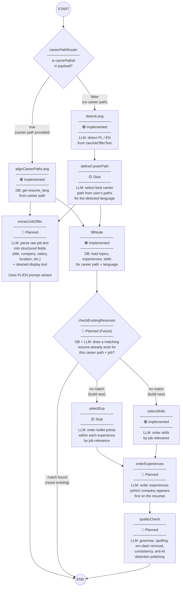

# Resume Agent Flow Specification

> **Date:** 2026-07-28  
> **Applies to:** [resumeAgent](file:///Users/qemc/Documents/Code/resume_agent-1/apps/backend/src/agentic/resume/resume.ts) in `apps/backend/src/agentic/resume/`  
> **Purpose:** Comprehensive architecture specification and node lifecycle for the Resume / Job Application agent workflow.

---

## 1. Complete Workflow Diagram

---

## 2. Implementation Status Legend

| Status | Meaning | Code Location / Details |
|--------|---------|-------------------------|
| 🟢 **Implemented** | Working logic with error handling in codebase | Functions in [nodes.ts](file:///Users/qemc/Documents/Code/resume_agent-1/apps/backend/src/agentic/resume/nodes.ts) |
| 🟡 **Stub** | Node function signature exists, body needs implementation | Function shell in [nodes.ts](file:///Users/qemc/Documents/Code/resume_agent-1/apps/backend/src/agentic/resume/nodes.ts) |
| 🔴 **Planned** | Planned node for initial version, not yet in code | Prompt & node to be added |
| 🔴 **Planned (Future)** | Optimization deferred beyond v1 MVP | Feature branch logic |

---

## 3. Node Specification & Data Flow

### Phase 1: Routing & Language Alignment

1. **`careerPathRouter` (Router)**
   - **Type:** Conditional edge router
   - **Logic:** Checks if `state.carrerPathId` is provided in initial payload.
   - **Routes:** `true` → `alignCareerPathLang`, `false` → `detectLang`.

2. **`alignCareerPathLang` (DB Node)**
   - **Status:** 🟢 Implemented
   - **Logic:** Queries DB for target `careerPathId` and sets `state.language` to match the path's `resume_lang`.

3. **`detectLang` (AI Node)**
   - **Status:** 🟢 Implemented
   - **Logic:** Calls LLM model with `detectLangPrompt` to classify `rawJobOfferText` as `'EN'` or `'PL'`. Sets `state.language`.

4. **`defineCareerPath` (AI Node)**
   - **Status:** 🟡 Stub
   - **Logic:** Evaluates user's career paths matching `state.language` against job offer text to choose the optimal `careerPathId`.

---

### Phase 2: Parallel Parsing & Context Loading

5. **`extractJobOffer` (AI Node)**
   - **Status:** 🔴 Planned
   - **Dependencies:** Runs after language is resolved (`alignCareerPathLang` / `detectLang`).
   - **Logic:** Uses language-specific prompt (`PL` or `EN`) to parse `rawJobOfferText` into structured metadata (`job_title`, `company_name`, `salary`, `location`) and a readable `cleaned_job_text`. Connects directly to `END` as display-only metadata.

6. **`fillNode` (DB Node)**
   - **Status:** 🟢 Implemented
   - **Logic:** Queries database to fetch all associated `topics`, `experiences`, and `skills` for `state.carrerPathId` and `state.language`.

---

### Phase 3: Reuse Gate & Content Selection

7. **`checkExistingResumes` (DB + AI Conditional Gate)**
   - **Status:** 🔴 Planned (Future)
   - **Logic:** Checks if an existing generated resume snapshot matches the job offer & career path closely enough to reuse without re-running expensive sorting chains.
   - **Routes:** If match found → `END` (Reuse existing), If no match → `selectExp` & `selectSkills` in parallel.

8. **`selectExp` (AI Node)**
   - **Status:** 🟡 Stub
   - **Logic:** Ranks and orders bullet points (topics) within each experience container based on job description relevance using structured outputs.

9. **`selectSkills` (AI Node)**
   - **Status:** 🟢 Implemented
   - **Logic:** Ranks user skills by relevance to job description requirements using structured outputs.

---

### Phase 4: Final Polishing & Assembly

10. **`orderExperiences` (AI Node)**
    - **Status:** 🔴 Planned
    - **Logic:** Determines overall order of work experience blocks on the final resume layout.

11. **`qualityCheck` (AI Node)**
    - **Status:** 🔴 Planned
    - **Logic:** Performs final pass over generated text: corrects grammar/spelling, normalizes dashes, checks consistency, and applies natural phrasing adjustments.
